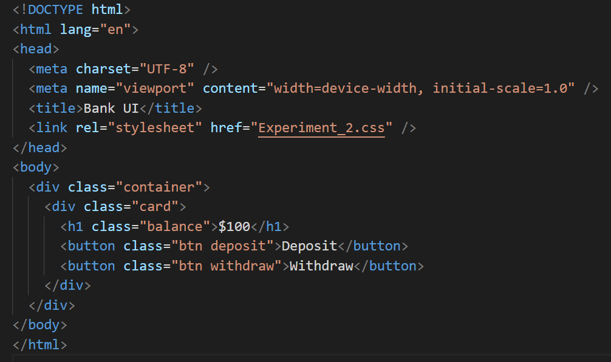
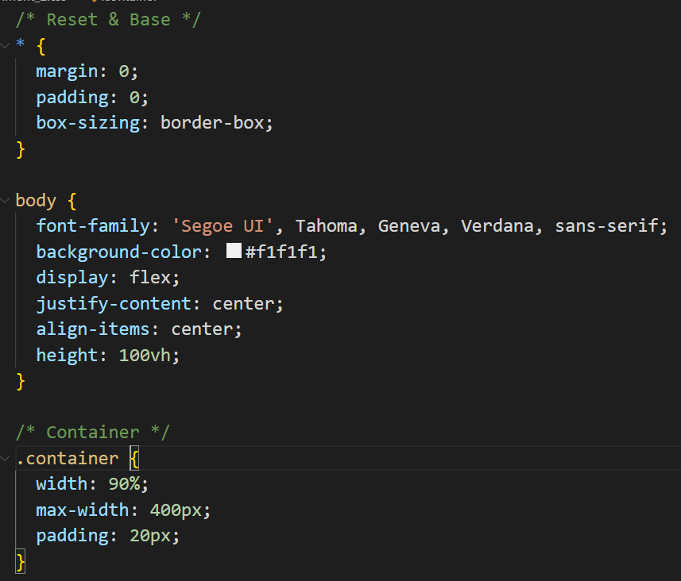
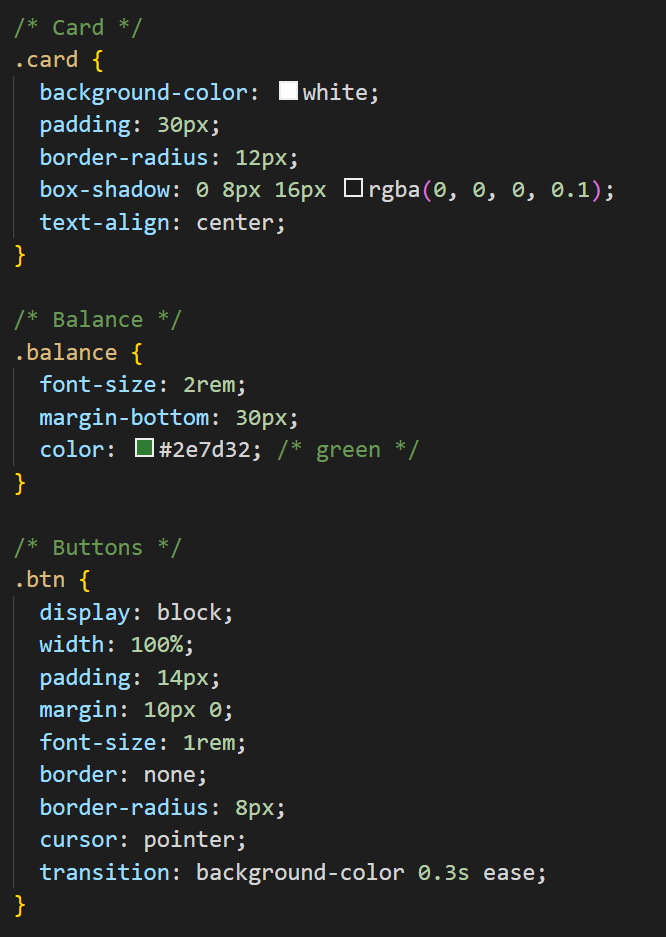
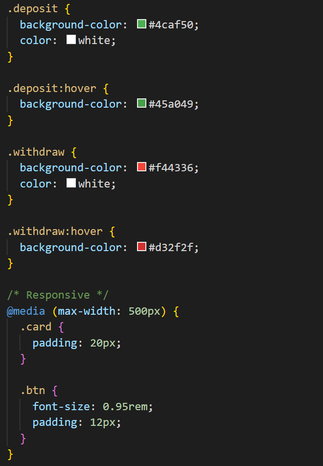
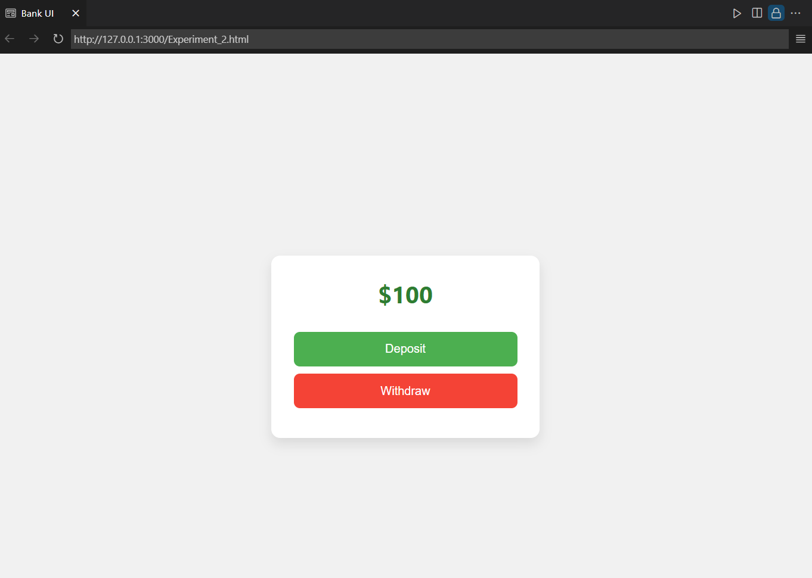

# Responsive Banking UI with Deposit/Withdrawal Buttons and Balance Display

## 🎯 AIM
Design a visually appealing and responsive banking user interface using only HTML and CSS, helping you practice modern layout techniques and styling without adding interactivity.
## 📋 Task Description
## Banking Interface Requirements

### 🏦 Features to Include

- **Balance Display Section**
  - Can be a card or a highlighted box.
  - Should clearly show the current account balance.

- **Deposit Button**
  - Triggers the deposit action.

- **Withdraw Button**
  - Triggers the withdraw action.

---

### 🎨 UI Design Requirements

- **Center the Interface**
  - All content should be centered on the page both vertically and horizontally.

- **Professional Layout**
  - Ensure proper spacing, padding, and alignment.
  - Use consistent margins and a clean font.

- **Responsive Design**
  - Interface must adapt gracefully to different screen sizes:
    - ✅ Desktop
    - ✅ Tablet
    - ✅ Mobile

## Screenshots
### Code-HTML5

### Code-CSS

### Result

### 🎯 Learning Outcome

- Understand modern layout techniques using HTML and CSS.
- Practice building responsive UI without JavaScript.
- Improve design skills for clean and professional web interfaces.

